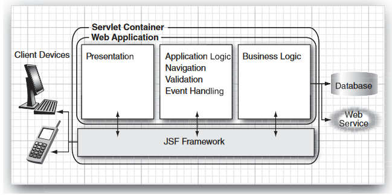
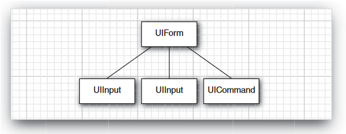
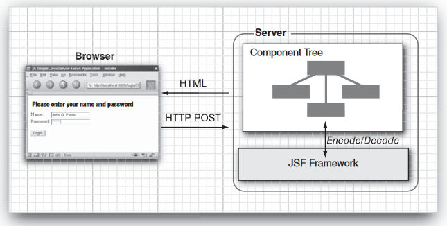
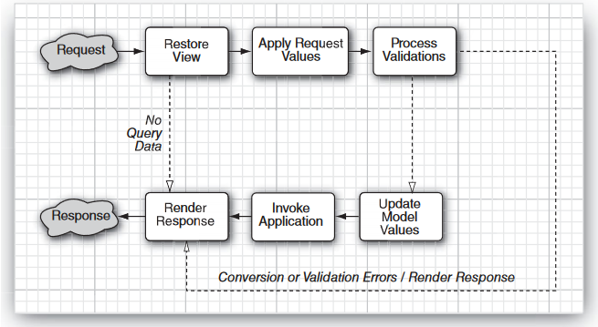

# JavaServer Faces核心编程

## JSF 简介

&emsp;&emsp;JavaServer Faces是一种基于组件的框架。例如，如果想要显示一个带有行和列的表格，就不必在循环结构中为行和单元格生成HTML标签，只需将表格组件添加到页面中即可（类似Swing）。

&emsp;&emsp;JSF是Java EE标准中的视图层。每个Java EE应用服务器都包含JSF。

> &emsp;&emsp;在JSF 2.0发布之前，只有将“导航规则”添加到`WEB-INF/faces-config.xml`文件中，才能指定当用户单击按钮时应当显示的页面。在JSF 2.0中，可直接在按钮的`action`特性中制定页面名称（仍可以使用导航规则）。

JSF包含三个部分：
+ 一套预置的UI（用户界面）组件
+ 一个事件驱动的编程模型
+ 一个组件模型，它支持第三方开发商提供额外的组件

&emsp;&emsp;Web 应用程序包含两个部分：表示层和业务逻辑层。表示层关心的是应用程序的外观。在基于浏览器的应用程序环境中，外观是由HTML 标签确定的，它指定了布局、字体和图像等。业务逻辑在Java 代码中实现，用于确定应用程序的行为。

&emsp;&emsp;将表示层与业务逻辑层分离是非常重要的。这样Web 设计人员和程序员都能专心发挥他们的特长。在JSF 上下文中，应用程序代码包含在bean 中，设计包含在网页中。

> &emsp;&emsp;根据bean规范，省略getter 或 setter 方法是合法的。例如，如果省略getPassword，那么password是只写属性。考虑到安全方面的因素，这是可取的。但JSF 并不支持只写属性。你始终为输入组件使用读/写属性。然而，可以为输出组件使用只读属性。

&emsp;&emsp;一个受管bean是可从JSF页面访问的Java bean。受管bean必须具有名称和作用域。按以下方式管理bean：在JSF页面中遇到bean名称时，JSF实现按照该名称定位对象，如果在适当的作用域中还不存在该对象，就创建它。

#### JSF 页面

&emsp;&emsp;由于历史原因，可采用许多不同的机制来制作JSF 页面。JSF 1.x基于JSP。JSF 允许程序员替换用于处理JSF 页面的“视图处理程序”。Facelets 已经成为了JSF 2.0的一部分。
```jsp
<!-- 第2行声明JSF HTML标签h:前缀 -->
<!-- 第3行声明JSF 核心标签f:前缀 -->
<html xmlns="http://www.w3.org/1999/xhtml"
  xmlns:h="http://java.sun.com/jsf/html"
  xmlns:f="http://java.sun.com/jsf/core">

<!-- JSF早期版本，JSP语法定义的JSF页面 -->
<html>
  <%@ taglib uri="http://java.sun.com/jsf/core" prefix="f" %>
  <f:view>
    <head>...</head>
    <body>...</body>
  </f:view>
</html>
```
#### servlet 配置

在应用服务器中部署JSF 应用程序时，用户需要提供一个名为web.xml的配置文件
```xml
<?xml version="1.0" encoding="UTF-8"?>
<web-app xmlns:xsi="http://www.w3.org/2001/XMLSchema-instance"
  xmlns="http://java.sun.com/xml/ns/javaee"
  xmlns:web="http://java.sun.com/xml/ns/javaee/web-app_2_5.xsd"
  xsi:schemaLocation="http://java.sun.com/xml/ns/javaee
  http://java.sun.com/xml/ns/javaee/web-app_2_5.xsd"
  version="2.5">
  <servlet>
    <servlet-name>Faces Servlet</servlet-name>
    <servlet-class>javax.faces.webapp.FacesServlet</servlet-class>
  </servlet>
  <servlet-mapping>
    <servlet-name>Faces Servlet</servlet-name>
    <url-pattern>/faces/*</url-pattern>
  </servlet-mapping>
  <welcome-file-list>
    <welcome-file>faces/index.xhtml</welcome-file>
  </welcome-file-list>
  <context-param>
    <!-- 2.0增加对调试的支持，选项有Development、UnitTest、SystemTest和Production -->
    <param-name>javax.faces.PROJECT_STAGE</param-name>
    <param-value>Development</param-value>
  </context-param>
</web-app>
```
&emsp;&emsp;所有JSF 页面都传入Faces servlet中，该Faces servlet是JSF实现代码的一部分。配置中有一个前缀`/faces`，`servlet-mapping`元素确保了所有带有该前缀的URL都有Faces servlet来处理。

&emsp;&emsp;不能只在浏览器地址栏中输入`http://localhost/login/index.xhtml`。URL必须是`http://localhost/login/faces/index.xhtml`。映射规则激活作为JSF实现入口点的Faces servlet。

> 可以定义一个扩展映射来替代`/faces`前缀映射，然后使用URL`http://localhost/login/index.faces`
```xml
<servlet-mapping>
  <servlet-name>Faces Servlet</servlet-name>
  <url-pattern>*.faces</url-pattern>
</servlet-mapping>
```
> 为JSF 页面使用.jsf扩展名。这个配置仅影响Web开发人员，不影响Web应用程序的用户。URL仍然使用`.faces`扩展名或`/faces`前缀。
```xml
<context-param>
  <param-name>javax.faces.DEFAULT_SUFFIX</param-name>
  <param-value>.jsf</param-value>
</context-param>
```
### JSF 框架服务

&emsp;&emsp;JSF 框架负责与客户设备交互，并提供将可视表示、应用程序逻辑和Web应用程序的业务逻辑相连接的工具。但是，JSF的作用域被限制在表示层。数据库持久性、Web服务和其他后端连接都超出了JSF 的作用域。



JSF框架提供的一些最重要的服务：

+ **实现 模型—视图—控制器架构**——所有软件应用程序都允许用户操纵某些数据，这里的数据被称为模型。Web应用程序显示数据模型的视图，HTML（或类似的呈现技术）用于绘制这些视图。JSF连接视图和模型。
	```jsp
	<h:inputText value="#{user.name}"/>
	```
	此外，JSF实现作为控制器运行，它通过处理动作和值更改事件对用户做出反应，将它们路由到更新模型或视图的代码。
	```jsp
	<h:commandButton value="Login" action="#{user.check}"/>
	```
+ **数据转换**——用户以文本方式在Web表单中输入数据。业务对象接受数字、日期或者其他数据类型的数据。JSF使指定和自定义转换规则变得十分容易。
+ **验证和错误处理**——JSF使添加字段验证规则变得十分容易。
+ **国际化**——JSF管理国际化问题，例如字符编码和资源包的选择。
+ **自定义组件**——将组件开发人员开发的复杂组件简单地拖动到自己的页面上。例如日历组件。
	```jsp
	<acme:calendar value="#{flight.departure}" startOfWeek="Mon"/>
	```
+ **Ajax支持**——JSF提供了标准Ajax通信信道，可透明地调用服务器端操作并更新客户端组件。
+ **其他呈现方式**——扩展JSF框架以生成其他页面描述语言（例如WML或XUL)。

### 技术内幕

&emsp;&emsp;当浏览器链接到JSF时，例如：`http://localhost:8080/login/faces/index.xhtml`，JSF实现初始化JSF代码并读取`index.xhtml`页面。这个页面包含诸如`h:form`和`h:inputText`的标签。每个标签都有一个相关的**标签处理程序类**。当读取该页面时，执行相应的**标签处理程序**。**JSF标签处理程序**彼此协作来构建一颗**组件树**。

&emsp;&emsp;组件树是一种数据结构，其中包含JSF页面上所有用户界面元素的Java对象。



#### 呈现页面

&emsp;&emsp;接着呈现HTML页面。除JSF标签外的所有文本直接显示。JSF标签则被转换为HTML。其中每个标签都调用相关的组件。每个组件有一个呈现器以生成HTML输出，反应组件状态。
```jsp
<!-- h:inputText标签对应的组件呈现器生成以下输出 -->
<input type="text" name="unique ID" value="current value"/>
```

&emsp;&emsp;这个进程称为编码。`UIInput`对象的呈现器要求JSF实现查找`user.name`表达式的唯一ID和当前值。编码页被发送到浏览器，浏览器按通常的方式显示它。



#### 请求解码

&emsp;&emsp;当在浏览器中显示页面后，用户填写表单字段并单击登录按钮。浏览器将表单数据发回到Web服务器，格式化为一个POST请求。POST请求包含**表单的URL**（即当前页面的URL`/login/faces/index.xhtml`，而不是所要请求的页面的URL）、表单数据。

> &emsp;&emsp;注意：POST请求的URL与呈现表单的请求的URL一样。在提交表单后，将导航到新页面（由于这个原因，浏览器中显示的URL通常比所显示JSF页面的URL晚一步）。

> &emsp;&emsp;个人理解：这是JSF与servlet不同的地方，在servlet中，请求一个页面，发送的URL就是所要请求的页面的URL（http://localhost:8080/login/loginAction），所以地址栏显示的就是该URL。而在JSF中，请求一个页面，发送的URL却是当前页面的URL，所以地址栏显示的就是当前的URL。（请求的页面以参数的形式告知JSF，http://localhost:8080/login?action=loginAction），JSF根据参数action找到页面并呈现页面，当下次再发出请求的时候，又把当前页面URL（http://localhost:8080/login/loginAction）请求给Web服务器，所以浏览器地址栏显示的地址总是晚一步。

```
id1=me&id2=secret&id3=Login   // 表单数据是ID/值对形式的字符串
```

&emsp;&emsp;作为正常请求处理的一部分，表单数据位于所有组件都可以访问的哈希表中。JSF为每个组件提供了一个检查哈希表的机会，这个过程称为**解码**。每个组件自行决定如何解释表单数据。
+ `UIInput`组件更新`value`特性中引用的`bean`属性：使用用户提供的值调用`setter`方法。
+ `UICommand`组件检查用户是否单击了按钮。如果单击了，它触发动作事件来启动`action`特性引用的`login`操作。这个事件告诉导航处理程序查找后续页面`welocome.xhtml`。

#### 生命周期
+ 还原视图
+ 应用请求值
+ 过程验证
+ 更新模型值
+ 调用应用程序
+ 呈现相应

&emsp;&emsp;如果请求页面首次显示，**还原视图**阶段将创建新的组件树；如果请求的页面曾在以前显示过，**还原视图**将检索请求页面的组件树。

&emsp;&emsp;如果没有请求值，JSF实现会直接跳转到**呈现响应**阶段。这发生在页面第一次显示之时。

&emsp;&emsp;否则下一个阶段是**应用请求值**阶段，JSF实现迭代组件树中的每个组件对象。每个组件对象都检查哪些请求值属于自己并将其存储。

&emsp;&emsp;存储在组件中的值称做“本地值”。当设计JSF 页面时，可添加验证器以验证本地值的正确性。这些验证器在**处理验证**阶段执行。如果通过验证，JSF 生命周期正常进行。当发生转换或验证错误时，JSF 实现会直接调用**呈现相应**阶段，重新显示当前页以便用户有机会再次提供正确输入。

&emsp;&emsp;在转换器和验证器完成工作后，即认为可以安全地更新模型数据。在**更新模型值**阶段，会使用本地值来更新与组件关联的`bean`。

&emsp;&emsp;在**调用程序阶段**，引起表单提交的按钮或链接组件的`action`方法被执行。该方法可以执行任意的应用程序处理。它返回的结果字符串传给导航处理程序。导航处理程序然后查找下一个页面。

&emsp;&emsp;最后，**呈现响应**阶段对响应进行编码，并将它发回浏览器。当用户提交表单、单击链接或者生成新请求时，这个循环重新开始。



## 受管bean
&emsp;&emsp;Web应用程序设计的一个中心主题就是分离**表示**和**业务逻辑**。JSF使用bean来实现这种分离。JSF页面引用bean属性，在bean实现代码中包含程序逻辑。

### bean的定义
&emsp;&emsp;在JSF上下文中，bean存储Web页面的状态。Bean的创建和操作都在JSF实现的控制之下。JSF实现完成以下任务：
+ 酌情创建和丢弃bean（因此称其为“受管bean”）
+ 当显示Web页面时读取bean属性
+ 当发布表单时设置bean属性

&emsp;&emsp;当第一次遇到带有名称user的表达式时，JSF实现将构造类UserBean的一个对象。该对象在会话期间保持活动状态——也就是说，对来自同一个客户端的所有请求来说，该对象持续有效，除非会话被显式终止或者超时。在整个会话期间，bean名称user引用先前所构造的对象。

#### bean的属性
&emsp;&emsp;bean的属性具有以下特点的bean特性：
+ 一个名称
+ 一种类型
+ 获取和/或设置属性值的方法

&emsp;&emsp;JavaBean必须为属性**获取器**和**设置器**使用**命名模式**（否则必须定义info类，不常用)，方法名称和签名必须与模式完全匹配。方法名必须以`get`或`set`开头。`get`方法不得包含参数。`set`方法必须有一个参数并且没有返回值。

&emsp;&emsp;JavaBean规范没有规定`getter`和`setter`方法的行为。多数情况下，这些方法只是简单地操作实例字段。然而，它们也可以执行一些更复杂的操作，例如数据库查找、数据转换和验证等。

#### 值表达式
&emsp;&emsp;在JSF中，`#{user.name}`这种表达式称做值表达式。一个值表达式能用于读取以及写入某个值。

#### backing bean
&emsp;&emsp;一种包含有Web表单某些或者全部组件对象的bean称做Web表单的backing bean。
```java
@ManagedBean(name="quizForm")
@SessionScoped
public class QuizFormBean {
	private UIInput answerComponent;
	private UIOutput scoreComponent;

	public UIInput getAnswerComponent() { return answerComponent; }
	public void setAnswerComponent(UIInput newValue) { answerComponent = newValue; }

	public UIOutput getScoreComponent() { return scoreComponent; }
	public void setScoreComponent(UIOutput newValue) { scoreComponent = newValue; }
}
```

&emsp;&emsp;使用backing bean时，需要将表单上的组件与bean上的组件相连接：
```jsp
<h:inputText binding="#{quizForm.answerComponent}" />
```

#### CDI bean
&emsp;&emsp;CDI是一种比JSF受管bean功能更强大的机制，符合Java EE 6 要求的应用服务器（例如GlassFish)自动支持CDI。用户也可将CDI参考实现添加到Tomcat中。

&emsp;&emsp;使用CDI bean的方式与使用JSF受管bean的方法一样。但使用`@Named`注解来声明。然后按照与使用JSF受管bean相同的方式来使用值表达式`#{user}`或者`#{user.name}`。
```java
@Named("user")
@SessionScoped
public class UserBean implements Serializable {	}
```
> 必须包含文件`WEB-INF/beans.xml`以激活CDI bean处理。该文件可以为空，或者可以有选择地包含一些用于配置bean的指令。

&emsp;&emsp;除非应用程序必须运行在普通servlet运行器（比如Tomcat）中，建议在其他情况下使用CDI bean。

### 消息包

&emsp;&emsp;实现Web应用程序时，比较好的方法是将所有消息字符串集中在一个位置。便于保持消息一致性，更重要的是便于本地化处理。将消息字符串收集到一个文件中。用户可以选择任意目录路径和文件名称，但必须使用`.properties`扩展名。
```properties
guessNext=Guess the next number in the sequence!
answer=Your answer:
```
&emsp;&emsp;可以使用两种方法声明消息包。最简单的方法是在`WEB-INF`目录中添加`faces-config.xml`文件：
```xml
<!-- faces-config.xml文件用于配置JSF应用程序的许多方面。例如JSF版本 -->
<?xml version="1.0"?>
<faces-config xmlns="http://java.sun.com/xml/ns/javaee"
  xmlns:xsi="http://www.w3.org/2001/XMLSchema-instance"
  xsi:schemaLocation="http://java.sun.com/xml/ns/javaee
    http://java.sun.com/xml/ns/javaee/web-facesconfig_2_0.xsd"
  version="2.0">
  <application>
    <resource-bundle>
      <base-name>com.corejsf.messages</base-name>
      <var>msgs</var>
    </resource-bundle>
  </application>
</faces_config>
```

&emsp;&emsp;与使用全局资源包声明不同的是，可以将`f:loadBundle`元素添加到每个需要访问包的JSF页面中：
```jsp
<f:loadBundle basename="com.corejsf.messages" var="msgs" />
```

&emsp;&emsp;接着就能使用值表达式`#{msgs.guessNext}`来访问消息字符串。

&emsp;&emsp;当本地化一个包文件时，需要向文件名添加本地化后缀：下划线后跟两个小写字母`ISO-639`语言代码。例如德语`com/corejsf/messages_de.properties`。作为Java中对国际化支持的一部分，匹配当前地区的资源包是自动加载的。当没有合适的本地化资源包可以使用时，将使用没有本地化前缀的默认资源包。

> 消息包文件超过127的Unicode字符是以\uxxxx的转义序列编码的。native2ascii可以创建这些文件。

#### 具有可变部分的消息
&emsp;&emsp;通常消息有需要填充的可变部分：“你得了n分”。其中的n是从bean中检索的值。使用占位符生成一个资源字符串：
```properties
currentScore=Your current score is {0}.
# h:outputFormat标签使用标准库的MessageFormat类来格式化消息字符串。
currentScore=Your current total is {0,number,currency}.
```

&emsp;&emsp;占位符以{0}、{1}、{2}等编号。在JSF页面中使用`h:outputFormat`标签，并为占位符提供`f:param`子元素的值：
```jsp
<h:outputFormat value="#{msgs.currentScore}">
	<f:param value="#{quizBean.score}"/>
</h:outputFormat>
```

#### 应用程序的区域设置
&emsp;&emsp;三个选项设置自己应用程序的区域设置

1. 可让浏览器选择区域设置。在`WEB-INF/faces-config.xml`中设置默认和受支持的区域设置。当浏览器连接到应用程序时，通常在`HTTP`头中包含一个`Accept-Language`值。JSF实现读取头部，并在受支持的区域设置中找到最佳匹配：
	```xml
	<faces-config>
	<application>
		<locale-config>
			<default-locale>en</default-locale>
			<supported-locale>de</supported-locale>
		</locale-config>
	</application>
	</faces-config>
	```
2. 编写代码来执行区域设置。调用`UIViewRoot`对象的`setLocale`方法：
	```java
	UIViewRoot viewRoot = FacesContext.getCurrentInstance().getViewRoot();
	viewRoot.setLocale(new Locale("de"));
	```
3. 使用带有`locale`特性的`f:view`元素，可为一个单独页面执行区域设置：
	```jsp
	<f:view locale="de">
	<!-- 动态 -->
	<f:view locale="#{user.locale}"/>
	```

### bean作用域
&emsp;&emsp;对于JSF和CDI bean来说，有3个共有作用域。JSF在`javax.faces.bean`中，CDI bean在`javax.enterprise.context`中。JSF2.0增加了视图作用域和自定义作用域，CDI不支持，与此相反，CDI具有一个更为有用的对话作用域。
```java
@SessionScoped     // 会话作用域
@RequestScoped     // 请求作用域
@ApplicationScoped // 应用程序作用域
```

#### Session
问题：开两个浏览器窗口访问应用程序会使用同一个`session`还是不同`session`？

&emsp;&emsp;对`session`来说时只认`id`不认人，因此不同的浏览器，不同的窗口打开方式以及不同的`cookie`存储方式都会对这个问题的答案有影响。

&emsp;&emsp;经实践，`IE8`、`IE11`、`chrome`、`firefox`在同个窗口的不同`TAB`，两个不同的窗口，这两种情况都是使用的同一个`session`，而不是网上描述的不同窗口独立`session`。

#### 请求作用域
&emsp;&emsp;请求作用域的生命周期短。开始于提交HTTP请求，终止于响应返回到客户端。如果在请求作用域中放置一个受管bean，则为每个请求创建一个新实例。只有在用户关心会话作用域的存储开销时，才值得考虑请求作用域。

&emsp;&emsp;错误和状态消息数据通常放在请求作用域中。当用户提交表单数据时会对其进行计算，并在呈现响应时显示这些数据。于此类似，`f:loadBundle`标签将包变量放置在请求作用域中，仅在同一请求中的“呈现响应”阶段期间才需要该变量。

&emsp;&emsp;如果用户具有复杂数据，例如表的内容，那么请求作用域并不合适，因为用户需要为每个请求都重新生成数据。

> &emsp;&emsp;只有请求作用域bean是单线程的，因此具有与生俱来的线程安全特点。会话作用域的bean不是单线程的，一个用户可以同时从多个浏览器窗口提交响应。每个响应由独立的请求线程处理。如果需要线程安全，就必须提供锁机制。

#### 对话作用域
&emsp;&emsp;对话作用域的范围包括一系列相关页面。它提供在实现某个特定目标之前一直保留的数据持久性（而不要求为整个会话存储数据）。对话依赖于某个特定的浏览器页面或者选项卡。一个单独的会话可以在不同页面拥有多个对话。遵守下列规则：
+ 使用`@Namd`
+ 使用`@ConversationScoped`
+ 添加一个实例变量：`Conversation`

&emsp;&emsp;当创建bean时，将使用`Conversation`对象自动初始化该实例变量。
+ 调用`conversation.begin()`以将`bean`的作用域从请求作用域提升到对话作用域。
+ 调用`conversation.end()`以便从对话作用域中移除`bean`。

```java
@Named
@ConversationScoped
public class QuizBean implements Serializable {
	private @Inject Conversation conversation;

	public void setAnswer(String newValue) {
		try {
			if (currentIndex == 0) conversation.begin();
			int answer = Integer.parseInt(newValue.trim());
			if (getCurrent().getSolution() == answer) score ++;
			currentIndex = (currentIndex + 1) % problems.size();
			if (currentIndex == 0) conversation.end();
		} catch (NumberFormatException e) {}
	}
}
```

#### 视图作用域
&emsp;&emsp;JSF 2.0中增加了视图作用域`view scope`。当重新显示同一JSF页面时，视图作用域中的bean持续存在（JSF规范使用术语“视图”来指代JSF页面）。只要用户导航到一个不同的页面，bean就会离开作用域。

&emsp;&emsp;如果用户的页面一直在重新显示，就可以使保持有该页面数据的bean进入视图作用域中，从而减少了会话作用域的大小。这一点对于`Ajax`应用程序来说尤其有用。

#### 自定义作用域
&emsp;&emsp;作用域仅仅是一个将名称绑定到对象的映射。作用域之间的区别就体现在该映射的生存期长短上。4个标准的JSF作用域（会话、应用程序、视图和请求）的生存期是由JSF实现来管理的。对JSF 2.0来说，用户可以提供自定义作用域——可由用户自己管理映射的生存期。使用注解将bean放置到该映射中。
```java
@CustomScoped("#{expr}")
```

### 配置bean
#### 注入CDI bean
```java
@Named
@SessionScoped
public class EditBean {
	@Inject private UserBean currentUser;
	// 可以为属性设置器或构造函数添加注解达到同样目的
}
```

#### 注入受管bean
```java
@ManagedBean
@SessionScoped
public class EditBean implements Serializable {
	// UserBean的作用域不能小于EditBean的作用域
	@ManagedProperty(value="#{user}")
	private UserBean currentUser;

	// set方法必须提供
	public void setCurrentUser(UserBean newValue) { currentUser = newValue; }
}
```

#### bean生命周期注解
&emsp;&emsp;使用`@PostConstruct`和`@PreDestroy`注解来指定创建bean之后以及bean离开作用域之前被自动调用的bean方法。`@PostConstruct`注解对那些需要引入数据以便在页面上显示的bean来说非常有用。Bean的另一个常见用法就是建立与外部资源（例如数据库）的连接。
```java
public class MyBean {
	@PostConstruct
	public void initialize() {
		// initialization code
	}
	@PreDestroy
	public void shutdown() {
		// shutdown code
	}
}
```

#### 使用XML配置受管bean
1. **存放位置**
	+ WEB-INF/faces-config.xml
	+ 名为faces-config.xml的文件或者在JAR文件META-INF目录内部以.faces-config.xml结尾的文件
	+ WEB-INF/web.xml内部java.faces.CONFIG_FILES初始化参数中的列出的文件
	```xml
	<web-app>
	  <context-param>
	  <param-name>javax.faces.CONFIG_FILES</param-name>
	    <param-value>WEB-INF/navigation.xml,WEB-INF/managedbeans.xml</param-value>
	  </context-param>
	</web-app>
	```

2. **定义bean和设置属性值**
在XML配置文件中使用managed-bean元素来定义受管bean。设置属性值与`@Managed-Property`注解的用法类似。
	```xml
	<faces-config>
	  <managed-bean>
	    <managed-bean-name>user</managed-bean-name>
	    <managed-bean-class>com.corejsf.UserBean</managed-bean-class>
	    <managed-bean-scope>session</managed-bean-scope>
	      <managed-property>
	        <property-name>name</property-name>
	        <value>troosevelt</value>
	      </managed-property>
	      <managed-property>
	        <property-name>password</property-name>
	        <value>jabberwock</value>
	      </managed-property>
	  </maanged-bean>
	</face-config>
	```

### 表达式语言语法

#### 使用方括号
&emsp;&emsp;就像JavaScript一样，可以使用方括号替代点符号：`a.b` `a["b"]` `a['b']`

&emsp;&emsp;`user.password` `user["password"]` `user['password']`都是等效的表达式。使用方括号有以下原因：
+ 当访问数组或映射时，[]括号更直观。
+ []符号可与包含句点或破折号的字符串一起使用，`msgs["error.password"]`。
+ []符号允许用户动态计算属性：`a[b.propname]`。

#### 调用方法和函数
&emsp;&emsp;从JSF 2.0开始，用户可在值表达式中调用方法。
```jsp
#{stockQuote.price("ORCL")}
```

#### 复合表达式
+ 算术运算符`+ - * / %`，后两个运算符字母变量`div`和`mod`
+ 关系运算符`< <= > >= == !=`，字母变量`lt le gt ge eq ne`
+ 逻辑运算符`&& || !`，字母变量`and or not`
+ `empty`运算符。a是`null`、长度为0的数组或字符串、大小为0的`Collection`或`Map`，则`empty a`是`true`
+ 三元选择运算符`? :`

#### 方法表达式
&emsp;&emsp;方法表达式是描述需要在未来某时执行的方法调用的简捷形式（例如点击按钮时执行，而不是在视图生成时就调用）。

标签|特性|方法表达式类型
-|-|-
按钮和链接|`action`<br/>`actionListener`|`String action()`<br/>`void listener(ActionEvent)`
输入组件|`valueChangeListener`<br/>`validator`|`void listener(ValueChangeEvent)`<br/>`void validator(FacesContext, UIComponent, Object`)
`f:event`|`listener`|`void listener(ComponentSystemEvent)`
`f:ajax`|`listener`|`void listener(AjaxBehaviorEvent)`

## 导航
### 静态导航
&emsp;&emsp;在简单Web应用程序中，网页导航是静态的。单击特定按钮总是选择固定的JSF页面来呈现响应。
```jsp
<h:commandButton label="Login" action="weclcome"/>
```

&emsp;&emsp;动作`action`特性的值被称做结果`outcome`。结果可以有选择地被映射到一个**视图ID**（在JSF规范中，一个JSF页面被称作**视图**）。如果没有为特定结果提供映射，结果将按以下步骤转变为视图ID：
1. 如果结果没有文件扩展名，则后置当前视图的扩展名
2. 如果结果没有以 `a/`开头，则前置当前视图的路径

&emsp;&emsp;视图`/index.xhtml`中的`welcome`结果会生成目标视图ID `/welcome.xhtml`

> &emsp;&emsp;自JSF 2.0发布以来，结果到视图ID的映射是可选的。在JSF 2.0之前，需要为每个结果指定明确的导航规则。

### 动态导航
&emsp;&emsp;在大多数Web应用程序中，导航不是静态的。页面流不仅取决于用户单击了哪个按钮，也取决于用户的输入。

&emsp;&emsp;要实现动态导航，提交按钮必须有一个方法表达式。
```jsp
<h:commandButton label="Login" action="#{loginController.verifyUser}"/>
```
&emsp;&emsp;在`action`特性中，方法表达式不带参数。它可以具有任何的返回类型。返回值通过调用`toString()`被转换为一个字符串。
```java
String verifyUser() {
	if () return "success";
	else  return "failure";
}
```

> &emsp;&emsp;动作方法可以返回null来表示应该重新显示同一页面。在这种情况下，视图作用域被保留。任何非空的结果都会清除视图作用域，即使作为结果的视图与当前视图相同也是如此。

#### 将结果映射到视图ID
&emsp;&emsp;JSF的一个重要设计目标是分离表示逻辑和业务逻辑。当动态做出导航决策时，计算结果的代码并非一定要知道Web页面的确切名称。JSF提供了一种机制，用于将逻辑结果（`success` `failure`）映射到实际Web页面。

&emsp;&emsp;通过将`navigation-rule`条目添加到`faces-config.xml`中来实现。
```xml
<navigation-rule>
	<!-- 如果success结果在/index.xhtml中出现，就将其导航到/welcome.xhtml -->
	<from-view-id>/index.xhtml</from-view-id>
	<navigation-case>
		<from-outcome>success</from-outcome>
		<to-view-id>/welcome.xhtml</to-view-id>
	</navigation-case>
	<!-- 未指定from-view-id元素，该规则适用于所有页面 -->
	<navigation-rule>
		<navigation-case>
			<from-outcome>logout</from-outcome>
			<to-view-id>/loggedOut.xhtml</to-view-id>
		</navigation-case>
	<!-- 合并 -->
	<navigation-rule>
		<from-view-id>/index.xhtml</from-view-id>
		<navigation-case>
			<from-outcome>success</from-outcome>
			<to-view-id>/welcome.xhtml</to-view-id>
		</navigation-case>
		<navigation-case>
			<from-outcome>failure</from-outcome>
			<to-view-id>/newuser.xhtml</to-view-id>
		</navigation-case>
</navigation-rule>
```

### 重定向
&emsp;&emsp;你可以要求JSF实现重定向到一个新视图。JSP实现然后会将一个HTTP重定向发送到客户端。重定向响应告诉客户端下一页使用哪个URL。客户端然后生成到该URL的GET请求。

&emsp;&emsp;重定向页面速度较慢，因为需要到浏览器进行另一次往返（相当于点击一次按钮，浏览器要发送两次请求）。但重定向允许浏览器更新地址栏。

> &emsp;&emsp;就像第一章“请求解码”小节说的问题，浏览器地址栏显示的地址总是晚一步。如果使用重定向，浏览器会显示最新的URL。

&emsp;&emsp;如果不使用导航规则，则将字符串`?faces-redirect=true`添加到结果字符串：
```jsp
<h:commandButton label="Login" action="welcome?faces-redirect=true"/>
```

&emsp;&emsp;在导航规则中，在`to-view-id`之后添加`redirect`元素：
```xml
<navigation-case>
	<from-outcome>success</from-outcome>
	<to-view-id>/success.xhtml</to-view-id>
	<redirect/>
</navigation-case>
```

**重定向和 Flash**
&emsp;&emsp;为了尽量减少会话作用域的滥用，尽可能使用请求作用域使很有意义的。如果没有重定向元素，那么可以为在下一个视图中显示的数据使用请求作用域范围内的bean。如果使用重定向则有问题，因为提交了两次请求：
1. 客户端将请求发送到服务器。
2. 使用请求作用域范围内的bean填充请求作用域映射。
3. 服务器向客户端发送HTTP 302(临时移动)状态以及重定向位置。当前的请求至此结束，并且移除请求作用域内的bean。
4. 客户端生成到新位置的GET请求。
5. 服务器呈现下一个视图。但是，先前请求作用域内的bean不再可用。

&emsp;&emsp;为了克服这个问题，JSF 2.0提供了一个`flash`对象，它可在一个请求中填充并在下一个请求中使用（flash的概念借鉴了Rails网页框架中的Ruby）。flash的常见用法用于消息。
```java
ExternalContext.external = FacesContext.getCurrentInstanse().getExternalContext;
external.getFlash().put("message", "Your password is about to expire");
```

&emsp;&emsp;`ExternalContext.getFlash()`方法返回类`Flash`的一个对象，其中Flash类实现`Map<String, Object>`。

&emsp;&emsp;在JSF页面中，使用`flash`变量引用`flash`对象`#{flash.message}`。在消息呈现并且重定向的视图被传送至客户端之后，会自动从flash中移除消息字符串。

&emsp;&emsp;用户甚至可以在`flash`中保存一个值以用于多个请求。表达式`#{flash.keep.message}`会在`flash`中产生`message`键的值，并将其反向添加到另一个请求循环中。

> 如果发现在`flash`和`bean`之间塞入了大量数据，应改用对话作用域。

### REST式导航和书签URL
&emsp;&emsp;一种称做REST(Representational State Transfer，具有代表性的状态转移)的架构风格提倡Web应用程序应当像最初想象的那样使用HTTP。查找应当使用`GET`请求。使用`PUT`、`POST`和`DELETE`请求来执行创建、突变和删除。

&emsp;&emsp;从JSF 2.0发布以来，都对`GET`请求提供了支持。下面将描述这种支持。

#### 视图参数
&emsp;&emsp;有一个`GET`请求，用于显示某个特定项的信息：`http://myserver.com/catalog?item=1729`，在请求页面`catalog`顶部添加标签，定义一个**视图参数**用来接收该`GET`请求带过来的参数：
```jsp
<!DOCTYPE html>
<html xmlns="http://www.w3.org/1999/xhtml"
		xmlns:f="http://xmlns.jcp.org/jsf/core"
		xmlns:h="http://xmlns.jcp.org/jsf/html">
	<f:metadata>
		<f:viewParam name="item" value="#{catalog.currentItem}"/>
	</f:metadata>
	<h:head></h:head>
	<h:body></h:body>
	</html>
```

&emsp;&emsp;当处理这个`GET`请求时，`item`查询参数的值被传给`catalog bean`的`setCurrentItem`方法。

> 前面介绍怎么接收`GET`请求参数，下面介绍怎么发送`GET`请求和参数。

#### 获取请求链接和参数
&emsp;&emsp;想要使用`GET`请求进行导航，需要在发送`GET`请求的页面中添加按钮和链接。使用`h:button`和`h:link`标签（对用`POST`请求的`h:commandButton`和`h:commandLink`）。使用outcome特性指定目标视图ID：
```jsp
<h:button value="Query" outcome="catalog"/>
<!-- 可以提供一个值表达式 -->
<h:button value="Query" outcome="#{userBean.catalog}"/>
<!-- getCatalog方法被调用，生成一个结果字符串，然后注入导航处理程序。导航处理程序将值填入outcome -->
<h:commandButton label="Login" action="#{userBean.catalog}"/>
<!-- 单击Login按钮，调用userBean中的catalog方法。并不会先加get再调用 -->
```

&emsp;&emsp;`h:button`的`outcome`特性和`h:commandButton`的`action`特性之间存在本质区别。`outcome`特性求值发生在页面被呈现之前。而`action`特性只是在单击了命令按钮时才会被求值。因此，JSF规范使用术语抢占式导航来计算`GET`请求的目标视图ID。

> `outcome`特性中的EL表达式是一个值表达式，并非方法表达式。计算目的是供以后使用。

&emsp;&emsp;`GET`请求的查询参数有三种来源，多次指定同一个参数，优先选择列表中的后者：
+ 结果字符串
+ 视图参数
+ 嵌套的`f:param`标签

```jsp
<!-- 结果字符串 -->
<h:link outcome="index?q=1" value="Skip">
<!-- 多个参数要转义 -->
<h:link outcome="index?q=1&amp;score=0" value="Skip">
<!-- 值表达式 -->
<h:link outcome="index?q=#{quizBean.currentProblem+1}" value="Skip">
<!-- 将所有视图参数包含在查询字符串中 -->
<h:link outcome="index" includeViewParams="true" value="Skip">
<!-- f:param标签重写视图参数 -->
<h:link outcome="index" includeViewParams="true" value="Skip">
   <f:param name="q" value="#{quizBean.currentProblem+1}"/>
</h:link>
```

&emsp;&emsp;重定向链接（也是一个`GET`请求）也能从包含的视图参数中获益。

```jsp
<h:commandLink action="index?faces-redirect=true@amp; includeViewParams=true" value="Skip"/>
```

```xml
<redirect include-view-params=true>
	<view-param>
		<name>q</name>
		<value>#{quizBean.currentProblem + 1}</value>
	</view-param>
</redirect>
```

## 标准JSF标签

&emsp;&emsp;JSF 1.2有两个标签库：**核心标签库**和**HTML标签库**。JSF 2.0共有6个标签库，包含的标签数量超过100个。

标签库|名称空间标识符|常用前缀|标签数量
-|-|-|-
核心|`http://java.sun.com/jsf/core`|`f:`|27
HTML|`http://java.sun.com/jsf/html`|`h:`|31
Facelets|`http://java.sun.com/jsf/facelets`|`ui:`|11
复合组件|`http://java.sun.com/jsf/composite`|`composite:`|12
JSTL核心|`http://java.sun.com/jsp/jstl/core`|`c:`|7
JSTL函数|`http://java.sun.com/jsp/jstl/functions`|`fn:`|16